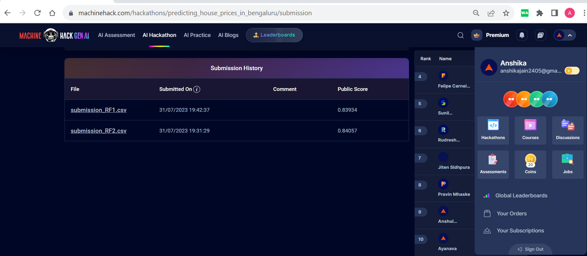

# OrionDataAnalyticsInternshipJul23-Proj2

What are the things that a potential home buyer considers before purchasing a house? The location, the size of the property, vicinity to offices, schools, parks, restaurants, hospitals or the stereotypical white picket fence? What about the most important factor – the price? To make this task of finding the price of houses easier we analyse and create a model using the given datasets. This dataset is part of a machine hack competition we also share the achieved accuracy of the model.

While making this project some very important things that I learnt were:
- What is cookie-cutter and poetry and what is their use
- How to save and call our functions from separate file
- How to geoencode our locations
- What is API and how it is used
- To use .env files to keep secrets, ie, the links that are private to us 
- Usage of requests library
- When to use dataclasses
- How to perform geospatial analysis
- How to remove previously added unwanted files from github only
- How to save our model using joblib and load it later
- How to add image with link to file

The link to my report: [Project Report](https://anshikajain2405.github.io/OrionDataAnalyticsInternshipJul23-Proj2/docs.html)

- [Cookie Cutter](https://github.com/khuyentran1401/data-science-template/tree/prefect-poetry) for project template
- Install [Poetry](https://python-poetry.org/docs/#installation): `pip install poetry`
- Create virtual environment: `poetry shell`
- Install libraries using poetry: `poetry add (pandas)`
- Install [Chocolatey](https://chocolatey.org/install)
- Install makefile: `choco install make`
- Free API: mapbox, [geocode](https://geocode.maps.co/)
- To remove unwanted files from github: `git rm --cached (filename)`
- Convert .ipynb to .qmd: `quarto convert (relative\path\notebook)`
- To add nbconvert for quarto render: `poetry add nbformat nbclient`
- For quarto to recognise python in virtual environment: `set (QUARTO_PYTHON)=(link)`
- To check quarto: `quarto check`
- To render quarto files: `quarto render (filename)`
- Install streamlit to create webapp: `poetry add streamlit`
- To check that streamlit has been correctly installed: `streamlit hello`

